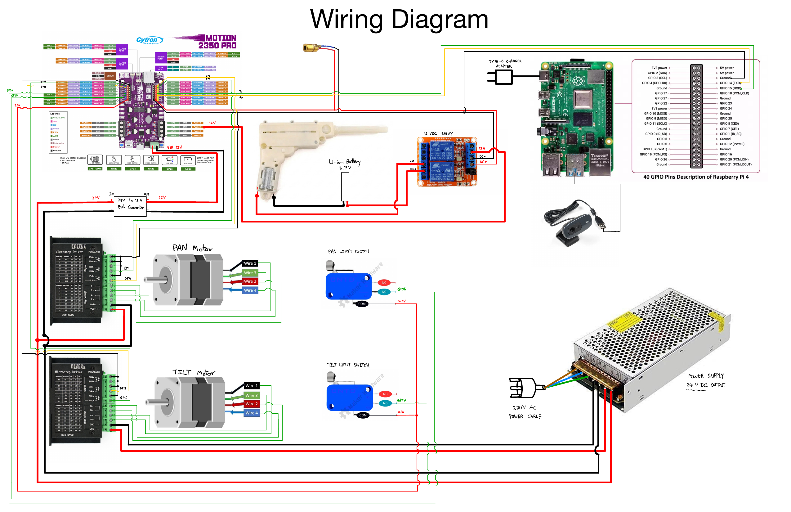

# Sentry Gun Project: Automated Target Tracking & Firing System

This repository contains the complete documentation, source code, and design files for the **Sentry Gun Project**. This system is an intelligent robotic platform designed to detect, track, and engage targets autonomously using Computer Vision and high-precision stepper motor control.

## Table of Contents
1. [Rationale of the Project](#1-rationale-of-the-project)
2. [Background and Related Previous Works](#2-background-and-related-previous-works)
3. [Overall Diagram](#3-overall-diagram)
4. [Python Program (Control & Vision)](#4-python-program-control--vision)
    - [Raspberry Pi 4 (Master Logic)](#raspberry-pi-4-master-logic)
    - [Raspberry Pi Pico (Motor Control))](#raspberry-pi-pico-motor-control)
5. [The Part Lists (BOM](#5-the-part-lists-bom)
6. [Demonstration Clip](#6-demonstration-clip)
7. [CAD Design](#7-cad-design)
8. [High-Quality Render](#8-high-quality-render)
9. [Animation](#9-animation)

---

## 1. Rationale of the Project
In environments requiring constant surveillance or rapid response—such as security zones or agricultural pest control—manual operation is often limited by human reaction time and fatigue. The **Sentry Gun Project** was born from the need for an accessible, automated solution that bridges the gap between digital detection (Computer Vision) and physical action. By automating the aiming and firing process, we eliminate human error and provide a 24/7 reliable defense or interactive system that can react to targets with mathematical precision.

## 2. Background and Related Previous Works
This project builds upon the growing "DIY Sentry" community, combining advanced kinematics with affordable hardware like the Raspberry Pi and Stepper Motors. 

**Inspiration and References:**
* **Targeting Inspiration:** The logic for rapid engagement and firing was inspired by this automated blaster system: [Watch Inspiration on Instagram](https://www.instagram.com/reel/DE1dFRIs2EO/?utm_source=ig_web_copy_link).
* **Mechanical Foundation:** The core CAD structure and gimbal mechanism were adapted and modified from the [Pan-Tilt Stepper Motor Gimbal project on Printables](https://www.printables.com/model/921719-pan-tilt-stepper-motor-gimbal), ensuring a robust and smooth 2-axis movement.

## 3. Overall Diagram
The system architecture integrates a Raspberry Pi 4 for vision processing, connected to a Raspberry Pi Pico (on the Cytron Motion 2350 PRO) via UART. The mechanical system is powered by a 24V DC supply, driving NEMA steppers through microstep drivers.

*(Please ensure you have the 'Wiring_Diagram.png' in your repository root)*


## 4. Python Program (Control & Vision)

### Raspberry Pi 4 (Master Logic)
Handles object detection (OpenCV), coordinate transformation, and user commands.

```python
import cv2
import numpy as np
import math
import serial
import time

# ==========================================
#           1. ตั้งค่าเริ่มต้น (CONFIGURATION)
# ==========================================
WS, HS = 600, 500              # ขนาดหน้าจอที่แสดงผล
PORT = '/dev/serial0'          # พอร์ตเชื่อมต่อ Serial กับ Pico
BAUDRATE = 115200
STEPS_PER_DEG = 126.67         # อัตราส่วน Step มอเตอร์ต่อ 1 องศา

CAMERA_CONSTANT = 5800.0       # ค่าคงที่สำหรับคำนวณระยะห่าง (Depth)
colorLower = (25, 50, 70)      # ช่วงสีเหลือง (HSV) ขอบเขตล่าง
colorUpper = (50, 255, 255)    # ช่วงสีเหลือง (HSV) ขอบเขตบน

# ข้อมูลทางกายภาพของหุ่นยนต์ (หน่วยเป็น มม.) สำหรับคำนวณ Kinematics
a, b, c, d, e, f, g, h = 68.50, 40.98, 63.49, 68.42, 63.80, 107.15, -2.62, 60.68
LASER_Y_OFFSET = -a + c - e    # ระยะเยื้องของแกนยิงในแนวแกน Y
LASER_Z_OFFSET = b + g + d + h  # ระยะเยื้องของแกนยิงในแนวแกน Z
TENNIS_BALL_DIA_MM = 67.0      # ขนาดจริงของลูกเทนนิส

# ค่าชดเชยสำหรับการเล็ง (Tuning)
TUNE_PAN, TUNE_TILT = -0.04, -0.5  

# ==========================================
#           2. ฟังก์ชันหลัก (CORE FUNCTIONS)
# ==========================================

def calculate_target_angles(Y_c, Z_c, depth_cm):
    """
    ฟังก์ชันคำนวณหาองศาของแกน Pan และ Tilt จากพิกัดภาพและระยะห่าง
    """
    X_c = depth_cm * 10.0      # แปลงหน่วยจาก ซม. เป็น มม.
    # สร้าง Matrix ตำแหน่งเป้าหมายในพิกัดกล้อง
    P_cam = np.array([X_c, Y_c, Z_c, 1.0])
    
    # คำนวณหาพิกัดเป้าหมายเทียบกับฐานหุ่นยนต์ (Inverse Kinematics)
    T_PC = np.array([[1, 0, 0, f], [0, 1, 0, LASER_Y_OFFSET], [0, 0, 1, b + g + d], [0, 0, 0, 1]])
    P_base = T_PC @ P_cam
    XT, YT, ZT = P_base[0], P_base[1], P_base[2]
    
    # คำนวณองศา Pan (แนวราบ)
    R_xy = math.hypot(XT, YT)
    if R_xy < abs(LASER_Y_OFFSET): return None, None
    theta1_rad = math.atan2(-XT, YT) + math.acos(LASER_Y_OFFSET / R_xy)
    
    # คำนวณองศา Tilt (แนวดิ่ง)
    X_prime = XT * math.cos(theta1_rad) + YT * math.sin(theta1_rad)
    B_val, C_val = ZT - b, LASER_Z_OFFSET - b
    R_xz = math.hypot(X_prime, B_val)
    if R_xz < abs(C_val): return math.degrees(theta1_rad), None
    theta2_rad = math.atan2(X_prime, B_val) - math.acos(C_val / R_xz)
    
    # เพิ่มค่าชดเชย (Compensation) ตามขนาดลูกบอลและระยะห่าง
    pan_comp = math.degrees(math.atan2(TUNE_PAN * TENNIS_BALL_DIA_MM, X_c))
    tilt_comp = math.degrees(math.atan2(TUNE_TILT * TENNIS_BALL_DIA_MM, X_c))
    
    return math.degrees(theta1_rad) - pan_comp, math.degrees(theta2_rad) - tilt_comp

def wait_for_done(ser):
    """ฟังก์ชันรอการตอบกลับ 'DONE' จาก Pico เพื่อยืนยันว่าทำงานเสร็จแล้ว"""
    while True:
        if ser.in_waiting > 0:
            line = ser.readline().decode('utf-8', errors='ignore').strip()
            if "DONE" in line:
                return True
        time.sleep(0.01)

# ==========================================
#           3. ลูปการทำงานหลัก (MAIN LOOP)
# ==========================================

def run_sentry_system():
    cap = None
    ser = None

    try:
        # เชื่อมต่อ Serial
        ser = serial.Serial(PORT, BAUDRATE, timeout=1)
        ser.flush()
        print("[CONNECTED] Motion 2350 Online.")

        # รอให้ระบบ Homing (หาจุดเริ่มต้น) เสร็จก่อน
        print("[SYSTEM] Waiting for Homing...")
        wait_for_done(ser)
        print("[READY] Homing Complete. Control Mode Active.")

        # เริ่มต้นใช้งานกล้อง
        cap = cv2.VideoCapture(0)
        cap.set(3, WS)
        cap.set(4, HS)
        cx, cy = WS / 2.0, HS / 2.0
        
        is_aimed = False # สถานะการล็อคเป้า

        while True:
            ret, frame = cap.read()
            if not ret: break
            frame = cv2.flip(frame, 1) # กลับภาพซ้ายขวาเพื่อให้เหมือนกระจก
            
            # --- ส่วนการประมวลผลภาพ (Detection) ---
            blurred = cv2.GaussianBlur(frame, (11, 11), 0)
            hsv = cv2.cvtColor(blurred, cv2.COLOR_BGR2HSV)
            mask = cv2.inRange(hsv, colorLower, colorUpper) # กรองเฉพาะสีที่ต้องการ
            mask = cv2.dilate(cv2.erode(mask, None, iterations=2), None, iterations=2) # ลด Noise
            cnts, _ = cv2.findContours(mask, cv2.RETR_EXTERNAL, cv2.CHAIN_APPROX_SIMPLE)
            
            ball_detected = None
            if len(cnts) > 0:
                c = max(cnts, key=cv2.contourArea) # หาพื้นที่ที่ใหญ่ที่สุด (ลูกบอลหลัก)
                ((x, y), radius) = cv2.minEnclosingCircle(c)
                if radius > 15: # ตรวจสอบขนาดว่าใช่ลูกบอลจริงๆ ไหม
                    ball_detected = (x, y, radius)
                    cv2.circle(frame, (int(x), int(y)), int(radius), (255, 255, 255), 2) # วาดวงกลมล้อมเป้าหมาย

            # --- การแสดงผล UI บนหน้าจอ ---
            status_color = (0, 255, 0) if is_aimed else (0, 255, 255)
            status_text = "AIMED - F: FIRE | B: BURST" if is_aimed else "IDLE - PRESS 'L' TO LOCK"
            cv2.putText(frame, status_text, (20, 40), cv2.FONT_HERSHEY_SIMPLEX, 0.8, status_color, 2)
            cv2.putText(frame, "Q: Quit | L: Lock | F: Fire | B: Burst", (20, HS-50), 
                        cv2.FONT_HERSHEY_SIMPLEX, 0.6, (255, 255, 255), 1)
            
            cv2.imshow('Gunner Station', frame)
            key = cv2.waitKey(1) & 0xFF

            # --- คำสั่ง 1: ล็อคเป้าหมาย (กดปุ่ม 'L') ---
            if key == ord('l') and ball_detected:
                print("[ACTION] Locking Target (0.5s Rapid Sample)...")
                pan_samples, tilt_samples = [], []
                
                # เก็บค่าพิกัดหลายๆ ครั้งเพื่อความแม่นยำ (Averaging)
                for _ in range(15):
                    success, f = cap.read()
                    if not success: continue
                    f = cv2.flip(f, 1)
                    l_hsv = cv2.cvtColor(f, cv2.COLOR_BGR2HSV)
                    l_mask = cv2.inRange(l_hsv, colorLower, colorUpper)
                    l_cnts, _ = cv2.findContours(l_mask, cv2.RETR_EXTERNAL, cv2.CHAIN_APPROX_SIMPLE)
                    
                    if l_cnts:
                        lc = max(l_cnts, key=cv2.contourArea)
                        ((lx, ly), lr) = cv2.minEnclosingCircle(lc)
                        if lr > 10:
                            depth = CAMERA_CONSTANT / (lr * 2) # คำนวณระยะห่าง
                            mm_px = TENNIS_BALL_DIA_MM / (lr * 2) # สเกลพิกเซลเป็น มม.
                            p, t = calculate_target_angles((lx-cx)*mm_px, -(ly-cy)*mm_px, depth)
                            if p is not None:
                                pan_samples.append(p); tilt_samples.append(t)
                
                if pan_samples:
                    # คำนวณค่าเฉลี่ยและส่งคำสั่งขยับมอเตอร์
                    avg_p, avg_t = sum(pan_samples)/len(pan_samples), sum(tilt_samples)/len(tilt_samples)
                    sx, sy = int(avg_p * STEPS_PER_DEG), int(-avg_t * STEPS_PER_DEG)
                    ser.write(f"X{sx}Y{sy}\n".encode())
                    print(f"[MOVE] Sent X:{sx} Y:{sy}.")
                    wait_for_done(ser) # รอมอเตอร์หยุดหมุน
                    is_aimed = True
                    print("[READY] Target Locked.")

            # --- คำสั่ง 2: ยิงทีละนัด (กดปุ่ม 'F') ---
            elif key == ord('f'):
                if is_aimed:
                    print("[FIRE] Dispatching Single Shot...")
                    ser.write(b"F\n") 
                    wait_for_done(ser) 
                    print("[SUCCESS] Shot Finished.")
                    is_aimed = False # ยิงแล้วปลดล็อคเป้า
                else:
                    print("[WARNING] Lock target first!")

            # --- คำสั่ง 3: ยิงรัว (กดปุ่ม 'B') ---
            elif key == ord('b'):
                if is_aimed:
                    print("[FIRE] Dispatching 3-Round Burst...")
                    ser.write(b"B\n") 
                    wait_for_done(ser)
                    print("[SUCCESS] Burst Finished.")
                    is_aimed = False
                else:
                    print("[WARNING] Lock target first!")

            elif key == ord('q'):
                break

    except Exception as e:
        print(f"[CRASH] {e}")

    finally:
        print("quiting...")
        if cap: cap.release()
        if ser: ser.close()
        cv2.destroyAllWindows()

if __name__ == "__main__":
    run_sentry_system()
```

### Raspberry Pi Pico (Motor Control)
```python
from machine import Pin, UART
import time
import math

# --- 1. การตั้งค่าขาเชื่อมต่อ (SETUP) ---
PAN_STEP, PAN_DIR = Pin(0, Pin.OUT), Pin(1, Pin.OUT)
TILT_STEP, TILT_DIR = Pin(16, Pin.OUT), Pin(17, Pin.OUT)
PAN_LIM, TILT_LIM = Pin(26, Pin.IN, Pin.PULL_DOWN), Pin(27, Pin.IN, Pin.PULL_DOWN)
FIRE_PIN = Pin(8, Pin.OUT) # ขาควบคุมการยิง
uart = UART(1, baudrate=115200, tx=Pin(4), rx=Pin(5), timeout=100)

# ค่าคงที่สำหรับการเคลื่อนที่
STEPS_PER_DEG = 126.67
MIN_DELAY, MAX_DELAY = 250, 500 # หน่วงเวลา Step (น้อย=เร็ว, มาก=ช้า)
curr_p, curr_t = 0, 0           # ตำแหน่งปัจจุบัน
LIMITS = {'P_POS': 11400, 'P_NEG': -11400, 'T_POS': 3800, 'T_NEG': -5320} # ขีดจำกัดองศา

@micropython.native # สั่งให้ทำงานด้วยความเร็วสูงสุด
def pulse(p, t, delay):
    """ส่งสัญญาณ Pulse ให้มอเตอร์หมุน 1 Step"""
    if p: PAN_STEP.value(1)
    if t: TILT_STEP.value(1)
    time.sleep_us(20) # ยืนยันสัญญาณคงที่
    PAN_STEP.value(0); TILT_STEP.value(0)
    time.sleep_us(int(delay))

def move_s_curve(rel_x, rel_y):
    """
    ควบคุมมอเตอร์ให้ขยับแบบ S-Curve: เริ่มต้นช้า -> เร็วตรงกลาง -> ช้าตอนจบ
    ช่วยลดการสั่นสะเทือนของโครงสร้างหุ่นยนต์
    """
    global curr_p, curr_t
    
    # ตรวจสอบไม่ให้ขยับเกินขีดจำกัด (Clamp)
    tp = max(min(curr_p + rel_x, LIMITS['P_POS']), LIMITS['P_NEG'])
    tt = max(min(curr_t + rel_y, LIMITS['T_POS']), LIMITS['T_NEG'])
    ax, ay = int(tp - curr_p), int(tt - curr_t)
    
    if ax == 0 and ay == 0: return
    print(f"[MOVE] X:{ax} Y:{ay}")

    # กำหนดทิศทางการหมุน (Direction)
    PAN_DIR.value(0 if ax > 0 else 1)
    TILT_DIR.value(0 if ay > 0 else 1)
    
    total_steps = max(abs(ax), abs(ay))
    
    # ลูปคำนวณการหน่วงเวลาแบบ S-Curve
    for i in range(total_steps):
        progress = i / total_steps
        # ใช้ฟังก์ชัน cos เพื่อสร้างกราฟความเร็วที่นุ่มนวล
        s_multiplier = (math.cos(progress * math.pi * 2) + 1) / 2
        dynamic_delay = MIN_DELAY + (s_multiplier * (MAX_DELAY - MIN_DELAY))
        
        pulse(i < abs(ax), i < abs(ay), dynamic_delay)

    curr_p, curr_t = tp, tt

def fire(count):
    """
    ควบคุมการยิง โดยส่งสัญญาณไปที่ FIRE_PIN
    count: จำนวนนัดที่ต้องการยิง
    """
    for i in range(count):
        FIRE_PIN.value(1); time.sleep(0.16) # ปล่อยสัญญาณกระตุ้นการยิง
        FIRE_PIN.value(0); time.sleep(0.05 if i < count-1 else 0)

def run_homing():
    """
    โหมดหาจุดเริ่มต้น (Homing)
    หุ่นยนต์จะหมุนไปจนชน Limit Switch เพื่อเซ็ตพิกัด (0, 0)
    """
    print("Homing..."); PAN_DIR.value(1); TILT_DIR.value(1)
    p_l = t_l = False
    while not (p_l and t_l):
        if PAN_LIM.value(): p_l = True
        if TILT_LIM.value(): t_l = True
        pulse(not p_l, not t_l, 400)
    
    time.sleep(0.5); PAN_DIR.value(0); TILT_DIR.value(0)
    # หมุนกลับมาที่จุดศูนย์กลางหลังชนสวิตช์
    for i in range(13933): pulse(i < 13933, i < 5550, 300) 
    global curr_p, curr_t; curr_p, curr_t = 0, 0

# --- 2. ลูปรับคำสั่ง (MAIN LOOP) ---
try:
    run_homing()
    # แจ้งเตือน Pi 4 ว่า Homing เสร็จแล้ว
    [uart.write(b"HOMING_DONE\n") or time.sleep(0.2) for _ in range(3)]
    
    while True:
        if uart.any():
            time.sleep_ms(10)
            raw = uart.readline()
            if not raw: continue
            try:
                cmd = raw.decode().strip()
                if 'X' in cmd: # คำสั่งเคลื่อนที่ เช่น "X100Y50"
                    parts = cmd.split('Y')
                    move_s_curve(int(parts[0][1:]), int(parts[1]))
                elif cmd == 'F': fire(1) # คำสั่งยิงนัดเดียว
                elif cmd == 'B': fire(3) # คำสั่งยิง 3 นัด
                uart.write(b"DONE\n")    # แจ้งกลับว่าทำงานเสร็จแล้ว
            except: uart.write(b"ERROR\n")
except:
    FIRE_PIN.value(0) # กรณีเกิด Error ให้หยุดยิงทันทีเพื่อความปลอดภัย
```

## 5. The Part Lists (BOM)
Detailed specifications, suppliers, and pricing for all mechanical and electronic components.

🔗 **[View Bill of Materials (Google Docs)](https://docs.google.com/document/d/13ywRA99andXz3X4eBQuF-4wUD0CNCDNxtUGLMidMCd8/edit?tab=t.0)**

## 6. Demonstration Clip
See the Sentry Gun in action, tracking and engaging targets in real-time.

[](https://www.youtube.com/watch?v=y7a5NazC8Oo)

## 7. CAD Design
Complete 3D models of the Sentry Gun assembly.

📁 **[Download CAD Files (Google Drive)](https://drive.google.com/file/d/1mrUgY9s_Yw8mawP619Sirvth3tozgA6Q/view?usp=sharing)**

## 8. High-Quality Render
Visualization of the final assembled product.

🖼️ **[View Renders (Google Drive)](https://drive.google.com/file/d/17qIY9MEWtkzhQ20ECSBVelnX3ph_gVum/view?usp=sharing)**

## 9. Animation
Dynamic animation showing the range of motion and firing sequence.

🎬 **[Watch Animation (Google Drive)](https://drive.google.com/file/d/1w4ELWVbXcfN9jxWqPiFjKmMpadruqyHq/view?usp=sharing)**

---
